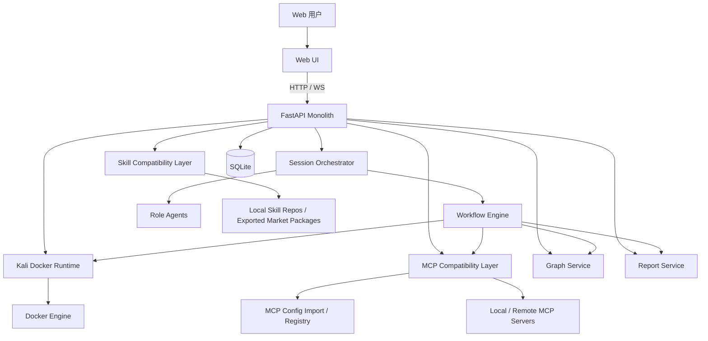
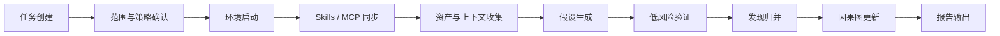

# 个人开源版架构设计文档
**项目定位**：面向授权环境的本地优先防御型安全研究工作台  
**项目代号**：aegissec  
**语言主栈**：Python + TypeScript  
**文档版本**：v1.0  
**适用范围**：SRC 自动化众测与主流漏洞发现、典型 CVE / 云安全 / AI 基础设施漏洞实测、多层网络与 OA 环境推演、基础域渗透模拟，以及相关证据整理与报告生成

---

## 1. 文档目标

本文档定义“个人开源版”项目的整体架构、边界、兼容策略、模块职责、数据流和落地方式。  
它不是“企业平台版”的拆分式微服务蓝图，而是**面向个人维护者的单体优先架构**：

- 本地优先，单机可跑
- 单体后端，避免早期分布式复杂度
- 保留 Web 对话、图谱、容器执行环境
- 保留 Skill / MCP 兼容能力
- **不自建 Skill 市场**
- **不自建 MCP 市场**
- 只做**兼容、识别、导入、展示、开关、调用编排**
- 兼容 Claude Code / OpenCode / 通用 Agent 的 Skill 与 MCP 约定

本项目的最高约束不是泛化 Agent 能力，而是持续服务以下四类核心场景：
- SRC 场景下的自动化众测与主流漏洞发现
- 典型 CVE、云安全与 AI 基础设施漏洞的可复现验证
- 多层网络与 OA 环境中的多步攻击路径规划、权限维持分析与证据串联
- 基础域渗透实验环境中的企业核心内网推演

因此，后续所有模块设计都应优先服务于**漏洞验证、攻击路径分析、证据沉淀与报告输出**，而不是脱离场景地扩张为泛化攻击平台。

---

## 2. 设计原则

### 2.1 单体优先，接口预留
第一版采用单体后端（FastAPI）+ 单页 Web 前端（React），后续再按需要拆分执行器、图服务、报告服务。

### 2.2 兼容优先，不重复造生态
本项目不重新设计自己的 Skill 格式与 MCP 协议，只做：
- Skill 目录扫描与元数据解析
- MCP 配置导入、启停、能力发现与调用
- Web 端展示与控制

### 2.3 本地优先
核心使用场景是个人开发、研究、靶场与实验环境。默认单机部署：
- SQLite 持久化
- 单 Kali Docker 执行器
- 单进程事件总线
- WebSocket 实时推送

### 2.4 第三方库优先
尽量使用成熟库替代手写底层：
- FastAPI / Pydantic / SQLModel / Docker SDK
- LangGraph（工作流编排）
- official `mcp` Python SDK（MCP 客户端）
- React Flow / Cytoscape.js（图谱）
- TanStack Query / Zustand（前端状态）
- PyYAML / ruamel.yaml（Skill frontmatter）

### 2.5 安全边界清晰
本项目定位为**授权环境下的防御性安全验证与研究自动化工作台**。  
默认强调：
- 容器隔离
- 明确审批点
- 低风险验证优先
- 日志留痕
- 风险路径图 / 证据因果图，而不是“黑盒自动化攻击平台”

### 2.6 场景驱动，避免目标漂移
功能优先级必须围绕四类核心场景收敛：
- 优先支持可复现验证，而不是抽象的自由攻击能力
- 优先支持攻击路径分析、证据关联与报告，而不是无边界动作编排
- 优先支持主流研究场景复用，而不是为了“平台感”引入脱离场景的复杂设计

---

## 3. 产品边界

## 3.1 In Scope（V1）
- Web 对话界面
- 会话管理
- Kali Docker 执行环境
- 角色化 Agent（同进程实现）
- 专用 Workflow 编排
- 技能识别与展示
- MCP 服务器导入 / 开关 / 能力发现 / 调用
- 任务图、证据图、因果图
- 报告导出

## 3.2 Out of Scope（V1）
- 自建 Skill 市场
- 自建 MCP 市场
- 多租户与复杂权限体系
- 分布式队列与多 worker 集群
- 图数据库（Neo4j）
- 插件市场与远程插件执行
- 企业级协作后台
- 完整 SaaS 化控制台

---

## 4. 目标用户与使用场景

### 4.1 核心用户
- 处理 SRC 场景与自动化众测任务的个人安全研究者
- 需要验证典型 CVE、云安全与 AI 基础设施问题的研究者
- 需要在多层网络、OA 或基础域环境中做防御性推演与证据整理的个人维护者
- 需要“本地 Agent Shell + Kali + Skills/MCP 兼容层”的开发者

### 4.2 典型场景
- 在授权 SRC 或实验环境中完成资产梳理、假设生成、低风险验证与结果归档
- 对典型 CVE、云安全配置缺陷与 AI 基础设施问题做可复现验证，并沉淀结构化证据
- 在多层网络与 OA 环境中进行多步攻击路径规划、关键节点验证、权限维持分析与因果串联
- 在基础域渗透实验环境中模拟企业核心内网研究流程，并通过图谱与报告沉淀全过程
- 借助外部 Skill 模板与 MCP 工具接入数据库、文件、浏览器、搜索、工单等能力
- 在 Web UI 中同步查看：
  - 对话流
  - 执行日志
  - 任务图
  - 证据因果图
  - 可用 Skills
  - 可用 MCP servers 及其开关状态

---

## 5. 总体架构



---

## 6. 架构分层

### 6.1 展示层（Web UI）
职责：
- 提供聊天界面
- 展示会话状态与执行日志
- 展示任务图 / 证据图 / 因果图
- 展示 Skills 列表
- 展示 MCP 服务器与工具能力
- 提供开关、重扫、导入、启动工作流等操作

建议技术：
- React + TypeScript + Vite
- React Router
- TanStack Query
- Zustand
- React Flow（任务图）
- Cytoscape.js（证据/因果图）
- shadcn/ui 或 Ant Design（二选一）

### 6.2 接入层（FastAPI API）
职责：
- 提供 REST API
- 提供 WebSocket 事件流
- 统一鉴权（V1 可简化为本地单用户）
- 会话入口
- Skill/MCP/Workflow/Graph/Report API

### 6.3 编排层（Orchestrator + Workflow Engine）
职责：
- 管理会话状态
- 读取 Workflow 模板
- 调度角色 Agent
- 触发 MCP 调用或容器执行
- 更新任务状态与图谱
- 控制审批点与中止点

建议技术：
- LangGraph（工作流/状态图）
- Pydantic State Model
- AnyIO / asyncio TaskGroup

### 6.4 兼容层（Skills / MCP）
职责：
- 扫描通用 Skill 目录
- 解析 Skill frontmatter
- 导入 MCP 配置
- 连接 MCP server
- 发现 tools/resources/prompts
- 让 Orchestrator 能“看到”可用能力

### 6.5 执行层（Kali Runtime）
职责：
- 管理 Kali 容器生命周期
- 执行受控命令
- 收集 stdout/stderr/exit_code/artifact
- 实施资源限制与超时
- 与 Workflow 交互

### 6.6 数据层（SQLite）
职责：
- 会话与消息持久化
- 技能与 MCP 元数据缓存
- 任务节点与图边存储
- 执行日志与工件索引
- 报告版本记录

---

## 7. 角色 Agent 设计（个人版）

企业版常见做法是“Agent Teams + Subagents + Worker”。  
个人版仍保留这个思想，但**不拆进程，不做多服务自治**，而是做成**同一进程内的角色化 Prompt Profiles**。

### 7.1 Coordinator
职责：
- 统筹会话
- 根据 Workflow 派发阶段任务
- 维护上下文摘要
- 控制审批点
- 决定是否调用 MCP / Runtime / Graph 更新

### 7.2 Planner
职责：
- 把用户目标转成阶段计划
- 输出任务图初稿
- 切分子任务
- 标记依赖关系与阻塞点

### 7.3 Researcher
职责：
- 处理信息汇总
- 整理资产、服务、证据、配置与外部上下文
- 归纳可疑点与验证假设

### 7.4 Operator
职责：
- 在审批后的前提下调用 Runtime 或 MCP
- 收集执行结果
- 结构化记录工件与日志

### 7.5 Reporter
职责：
- 维护发现列表
- 生成因果链
- 输出阶段性总结
- 导出 Markdown/HTML 报告

> V1 中，这些 Agent 都是同一个后端进程里的“角色配置”，不是独立微服务。  
> 好处是：实现简单、上下文共享容易、维护成本低。

---

## 8. 专用 Workflow 设计（个人开源版）

本项目面向授权环境下的防御性安全验证与研究自动化，因此工作流聚焦在**计划—收集—验证—归因—报告**的闭环，优先服务 SRC、典型 CVE / 云安全 / AI 基础设施、多层网络与 OA、基础域渗透模拟等代表性场景。



### 8.1 阶段说明

#### 阶段 1：任务创建
输入：
- 用户目标
- 目标环境描述
- 附加文件 / 备注

输出：
- Session
- 初始任务卡片

#### 阶段 2：范围与策略确认
输入：
- 允许范围
- 禁止动作
- 审批模式
- Runtime profile

输出：
- Scope Guard
- 执行策略
- 审批规则

#### 阶段 3：环境启动
动作：
- 检查 Docker
- 创建 / 复用 Kali 容器
- 挂载工作目录
- 初始化会话工作空间

输出：
- Runtime Ready

#### 阶段 4：Skills / MCP 同步
动作：
- 扫描 Skill 目录
- 导入 Claude/OpenCode/MCP 配置
- 发现 MCP tools/resources/prompts
- 更新 UI 列表

输出：
- Skill Catalog
- MCP Registry Snapshot

#### 阶段 5：资产与上下文收集
动作：
- 收集输入资产
- 收集会话上下文
- 整理观察、目标、配置、已知限制

输出：
- Evidence Nodes
- Task Graph 初稿

#### 阶段 6：假设生成
动作：
- Planner / Researcher 根据当前证据构造“待验证假设”

输出：
- Hypothesis Queue

#### 阶段 7：低风险验证
动作：
- 在审批门禁下运行低风险验证动作
- 调用 MCP 工具或容器命令
- 采集结果

输出：
- Validation Result
- Execution Artifact
- 更新任务状态

#### 阶段 8：发现归并
动作：
- 归并重复证据
- 提炼发现
- 标注置信度

输出：
- Findings List

#### 阶段 9：因果图更新
动作：
- 把“观察 → 假设 → 验证 → 结论”串成证据因果链

输出：
- Causal Graph

#### 阶段 10：报告输出
动作：
- 生成总结、证据引用、任务历史、结论列表

输出：
- Markdown Report
- HTML Report
- Session Snapshot

---

## 9. Skill 兼容层设计

## 9.1 目标
只做三件事：
1. **识别**
2. **解析**
3. **展示 / 暴露给编排层**

不做：
- Skill 市场
- Skill 下载器
- Skill 作者工作台
- Skill 沙箱执行平台

## 9.2 兼容目录
Skill 扫描固定为仓库根目录：

- `skills/**/SKILL.md`

不再扫描用户级或其他兼容目录；如需复用 OpenCode/Claude/其他 Agent 的 Skill，统一复制到仓库根目录 `skills/` 后再由兼容层识别。

## 9.3 统一元数据模型
```yaml
id: string
 source: local
 scope: project
root_dir: string
entry_file: string
name: string
description: string
compatibility:
  - claude
  - opencode
metadata: object
raw_frontmatter: object
status: loaded|invalid|ignored
```

## 9.4 解析策略
- 读取 `SKILL.md`
- 解析 YAML frontmatter
- 保留已知字段
- 未知字段放入 `raw_frontmatter`
- 校验名称、描述、目录一致性
- 计算哈希，支持增量重扫

## 9.5 在系统中的作用
- Web UI 中展示“可用 Skills”
- Planner 可读取其名称与描述做参考
- 用户可查看具体 Skill 文本
- 后续版本可把 Skill 作为 Prompt Resource 注入对话

> 由于你明确要求“保留识别功能即可”，V1 不强制实现完整的 Skill 执行语义兼容，只保证：
> - 能识别
> - 能展示
> - 能被编排层感知
> - 目录结构和元数据与 Claude/OpenCode 兼容

---

## 10. MCP 兼容层设计

## 10.1 目标
MCP 在本项目中不只是识别，还需要满足最小可用闭环：
- 识别配置
- 导入配置
- 启停控制
- 能力发现
- 调用工具
- 记录日志

## 10.2 支持的连接类型
### V1 必做
- Local / stdio
- Remote / HTTP（Streamable HTTP）

### V1 可选
- Legacy SSE（仅兼容导入与试验）

## 10.3 支持的配置来源
### Claude Code
- 项目：`.mcp.json`
- 用户：`~/.claude.json`

### OpenCode
- `opencode.json` 的 `mcp` 字段

### 自定义
- 项目自己的 `config/mcp/*.json`

## 10.4 统一 MCP Server 模型
```yaml
id: string
name: string
source: claude|opencode|custom
transport: stdio|http|sse
enabled: bool
scope: project|user|system
command: [string]
args: [string]
env: object
url: string
headers: object
timeout_ms: int
capabilities:
  tools: []
  resources: []
  prompts: []
status: disconnected|connecting|ready|error
last_error: string|null
```

## 10.5 UI 能力
- 服务器列表
- 开关启停
- 状态灯（ready/error/disabled）
- transport 显示
- 来源显示（Claude/OpenCode/Custom）
- tools/resources/prompts 数量显示
- 展开查看具体能力
- 重新发现能力
- 认证状态提示（未来增强）

## 10.6 实现建议
- 使用官方 Python `mcp` SDK 统一管理连接
- 为本地 stdio server 建立受控子进程
- 为 remote server 维护连接缓存
- 定期刷新能力快照
- 把 MCP 发现结果写入数据库

---

## 11. 图谱设计

用户原始诉求是“攻击图 + 因果图”。  
个人开源版建议调整为更稳妥、更可维护的三类图：

### 11.1 任务图（Task Graph）
用于展示 Workflow DAG：
- 当前阶段
- 子任务
- 依赖关系
- 完成状态
- 阻塞点

建议前端库：React Flow

### 11.2 证据图（Evidence Graph）
用于展示实体与观察关系：
- 目标
- 资产
- 服务
- 文件
- 工具输出
- 发现

建议前端库：Cytoscape.js

### 11.3 因果图（Causal Graph）
用于展示：
- 观察
- 假设
- 验证动作
- 结论

关系示例：
- supports
- contradicts
- derived_from
- validates
- blocked_by

---

## 12. 数据模型

建议最小表设计：

### 12.1 session
- id
- title
- status
- created_at
- updated_at
- runtime_profile

### 12.2 message
- id
- session_id
- role
- content
- event_type
- created_at

### 12.3 workflow_run
- id
- session_id
- template_name
- state
- current_stage
- started_at
- ended_at

### 12.4 task_node
- id
- workflow_run_id
- name
- type
- status
- parent_id
- metadata_json

### 12.5 graph_node
- id
- session_id
- graph_type
- node_type
- label
- payload_json

### 12.6 graph_edge
- id
- session_id
- graph_type
- source_node_id
- target_node_id
- relation
- payload_json

### 12.7 skill_record
- id
- source
- scope
- root_dir
- entry_file
- name
- description
- hash
- status
- raw_frontmatter_json

### 12.8 mcp_server
- id
- source
- scope
- name
- transport
- enabled
- config_json
- status
- last_error

### 12.9 mcp_capability
- id
- server_id
- capability_type
- name
- schema_json
- description

### 12.10 execution_run
- id
- session_id
- task_node_id
- executor_type
- command
- status
- stdout_path
- stderr_path
- exit_code
- started_at
- ended_at

### 12.11 artifact
- id
- session_id
- execution_run_id
- name
- path
- mime_type
- metadata_json

### 12.12 report
- id
- session_id
- version
- format
- path
- created_at

---

## 13. 模块划分与目录结构

```text
repo/
├─ README.md
├─ docs/
│  ├─ 00_个人开源版架构设计.md
│  ├─ 01_需求文档_PRD.md
│  ├─ 02_功能实现文档.md
│  └─ 03_开发计划文档.md
├─ apps/
│  ├─ api/
│  │  ├─ app/
│  │  │  ├─ api/
│  │  │  ├─ core/
│  │  │  ├─ db/
│  │  │  ├─ agents/
│  │  │  ├─ workflows/
│  │  │  ├─ compat/
│  │  │  │  ├─ skills/
│  │  │  │  └─ mcp/
│  │  │  ├─ runtime/
│  │  │  ├─ graphs/
│  │  │  └─ reports/
│  │  └─ pyproject.toml
│  └─ web/
│     ├─ src/
│     │  ├─ pages/
│     │  ├─ components/
│     │  ├─ stores/
│     │  ├─ hooks/
│     │  └─ lib/
│     └─ package.json
├─ config/
│  ├─ prompts/
│  ├─ workflows/
│  └─ mcp/
├─ docker/
│  └─ kali/
├─ examples/
│  ├─ skills/
│  └─ mcp/
└─ tests/
   ├─ unit/
   ├─ integration/
   └─ e2e/
```

---

## 14. 推荐技术栈

## 14.1 后端
- Python 3.12
- FastAPI
- Uvicorn
- Pydantic v2
- SQLModel（或 SQLAlchemy 2 + Pydantic）
- Alembic
- LangGraph
- Docker SDK for Python
- `mcp`（官方 Python SDK）
- PyYAML / ruamel.yaml
- structlog
- orjson
- httpx
- tenacity

## 14.2 前端
- React 18 + TypeScript
- Vite
- React Router
- TanStack Query
- Zustand
- React Flow
- Cytoscape.js
- Monaco Editor（查看 Skill / JSON 配置）
- xterm.js（可选，用于原始日志视图）

## 14.3 开发工具
- uv（Python 包管理）
- pnpm（前端包管理）
- ruff
- black
- mypy
- pytest
- Playwright
- pre-commit

---

## 15. 部署形态

## 15.1 V1 推荐部署
- 1 个 FastAPI 进程
- 1 个前端静态站点
- 1 个 SQLite 文件
- 1 个 Docker Engine
- 1 个 Kali 容器模板

## 15.2 docker-compose 形态
服务：
- api
- web
- sqlite（可内嵌，无单独服务）
- kali-runtime（按需起）
- optional: proxy

---

## 16. 性能与可维护性策略

### 16.1 为什么不用微服务
个人维护时，微服务会显著放大：
- 部署复杂度
- 调试成本
- 状态同步成本
- 日志排障成本

### 16.2 为什么先用 SQLite
- 本地优先
- 部署零负担
- 足够支撑单用户与中等量会话
- 迁移到 PostgreSQL 相对容易

### 16.3 为什么不先上图数据库
- V1 图谱量级有限
- 任务图和因果图完全可以用普通表 + JSON 存
- React Flow / Cytoscape 只关心 JSON 结构

---

## 17. 风险与缓解

| 风险 | 描述 | 缓解方案 |
|---|---|---|
| 兼容性碎片化 | Claude/OpenCode/通用 Agent 在 Skill frontmatter 上存在差异 | 采用“统一模型 + raw_frontmatter 保留” |
| MCP 连接不稳定 | 远程 server 鉴权、超时、协议差异 | 连接缓存、重试、状态灯、错误日志 |
| 上下文膨胀 | Skill + MCP tools 太多会使编排层过载 | 仅按需加载、UI 控制启停、按会话选择 |
| 个人维护压力大 | 功能面过宽 | V1 严格收敛：不做市场、不做多租户 |
| 容器执行风险 | Runtime 直接接触外部环境 | 资源限制、超时、挂载隔离、审批门禁 |

---

## 18. 里程碑建议

### MVP
- 对话
- Workflow
- Kali 执行器
- Skill 扫描
- MCP 导入/开关/发现
- 任务图
- 因果图
- 报告导出

### Beta
- 增量重扫
- Skill 内容预览
- MCP 认证状态
- 报告模板
- 会话快照回放

### v1.0
- 配置导入向导
- 可视化更稳定
- 更完整的测试与文档
- PyPI / Docker 镜像发布

---

## 19. 最终结论

这套“个人开源版”架构的核心取舍是：

**保留你真正需要的能力：**
- Web 对话
- 图谱展示
- Kali 容器
- 工作流
- Skills 兼容
- MCP 兼容

**去掉会拖慢个人项目的重量级设计：**
- 市场平台
- 多租户
- 微服务
- 图数据库
- 分布式 worker

这使得项目更适合个人维护，也更适合作为开源项目启动版本。

---

## 20. 参考资料

### 官方兼容依据
- Claude Code Skills: https://code.claude.com/docs/zh-CN/skills
- Claude Code MCP: https://code.claude.com/docs/zh-CN/mcp
- Claude Code Settings: https://code.claude.com/docs/zh-CN/settings
- Claude Code Plugins Reference: https://code.claude.com/docs/zh-CN/plugins-reference
- OpenCode Skills: https://opencode.ai/docs/zh-cn/skills/
- OpenCode Agents: https://opencode.ai/docs/zh-cn/agents/
- OpenCode MCP Servers: https://opencode.ai/docs/zh-cn/mcp-servers/
- OpenCode Commands: https://opencode.ai/docs/zh-cn/commands/
- OpenCode Plugins: https://opencode.ai/docs/zh-cn/plugins/
- MCP Specification Overview: https://modelcontextprotocol.io/specification/2025-06-18/basic
- MCP Python SDK: https://py.sdk.modelcontextprotocol.io/

### 参考项目
- Kali_Hack_Agent: https://github.com/ALKAERR/Kali_Hack_Agent
- LuaN1aoAgent: https://github.com/SanMuzZzZz/LuaN1aoAgent
- PentAGI: https://github.com/vxcontrol/pentagi
- ctfSolver: https://github.com/passer-W/ctfSolver
